# Enterprise Knowledge & Project Intelligence Assistant

An AI-powered enterprise assistant built using Google Gemini API that helps users with:

* AI/ML project recommendations
* Technology stack suggestions
* Dataset recommendations
* Learning roadmaps
* Enterprise SOP guidance
* Real-time conversational assistance

Built with **Node.js**, **Express**, **TypeScript**, and **Google Gemini**.

---

# Application Overview

The Enterprise Knowledge & Project Intelligence Assistant enables users to discover innovative AI projects, explore suitable datasets, select technology stacks, and generate detailed implementation roadmaps through natural language conversations.

---

## Home Screen

When the application launches, users are greeted with a conversational AI assistant capable of providing project intelligence and technical guidance.

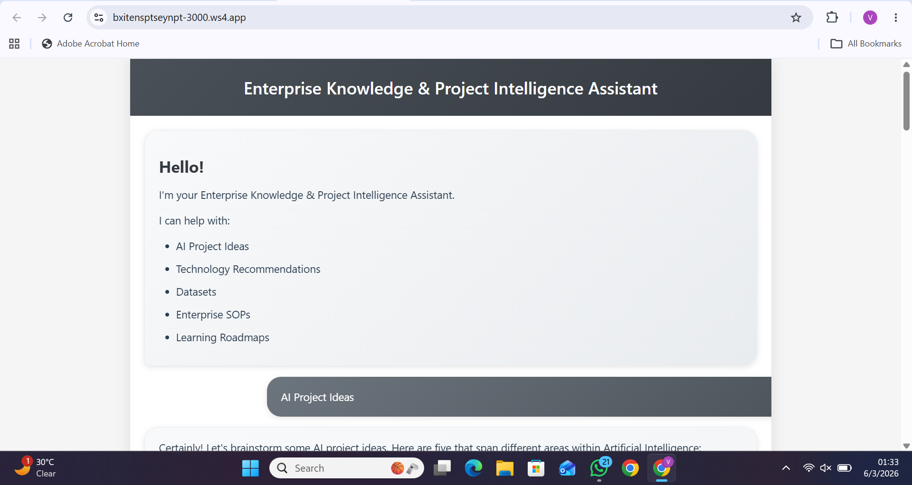

The assistant supports:

* AI Project Recommendations
* Technology Stack Guidance
* Dataset Suggestions
* Learning Roadmaps
* Enterprise SOP Assistance

---

## AI Project Recommendations

Users can ask for project ideas in domains such as Artificial Intelligence, Machine Learning, NLP, Cybersecurity, Finance, Healthcare, CRM, and more.

### Example Query

```text
AI Project Ideas
```

### Example Response

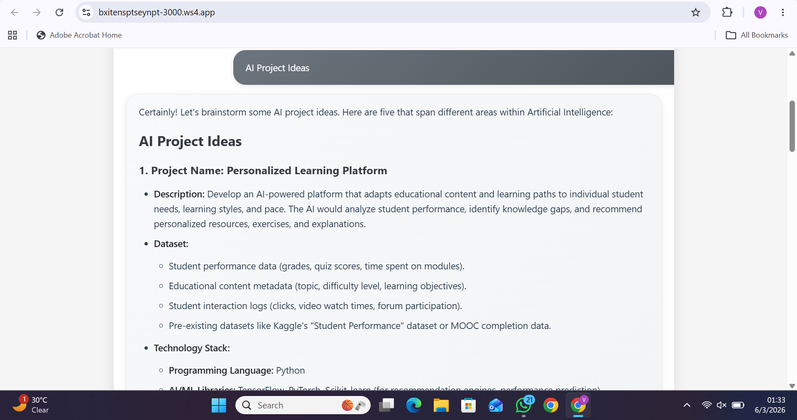

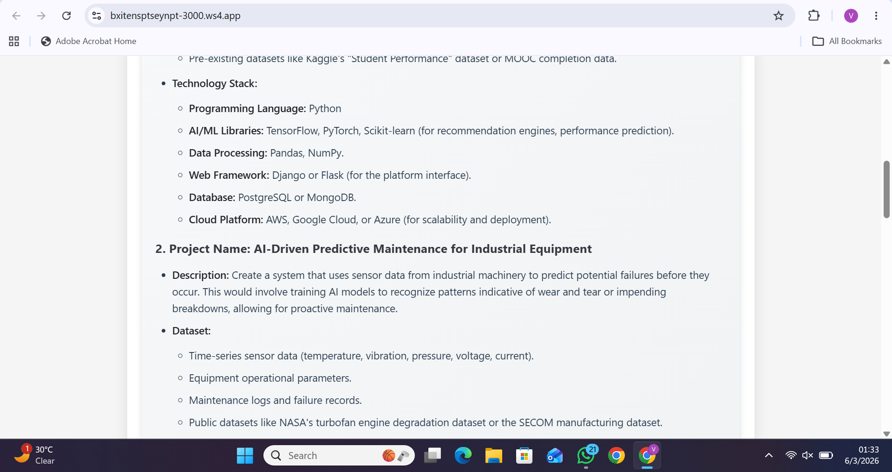
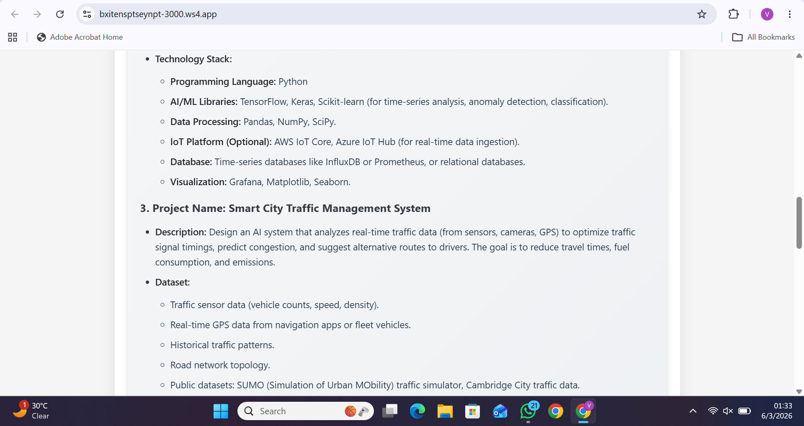
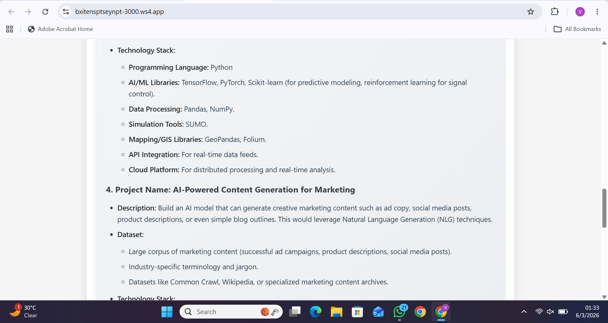
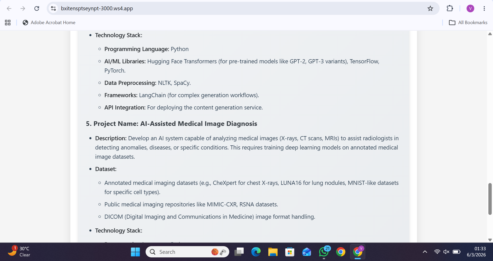
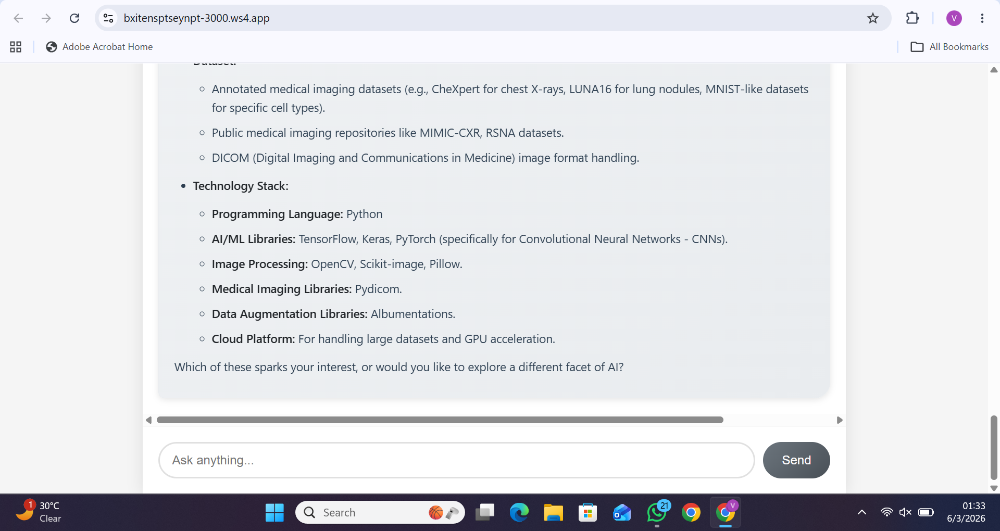

The assistant provides:

* Project Name
* Project Description
* Recommended Datasets
* Technology Stack
* Implementation Suggestions

---

## Personalized Project Selection

Users can select any suggested project and continue the discussion naturally.

### Example Query

```text
Personalized Learning Platform is good.
```

The assistant remembers the previous conversation context and generates detailed implementation guidance.

---

## Project Roadmap Generation

The assistant generates a complete implementation roadmap with development phases and milestones.

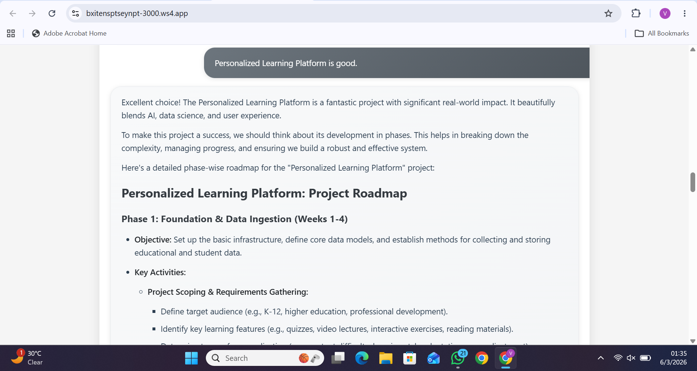
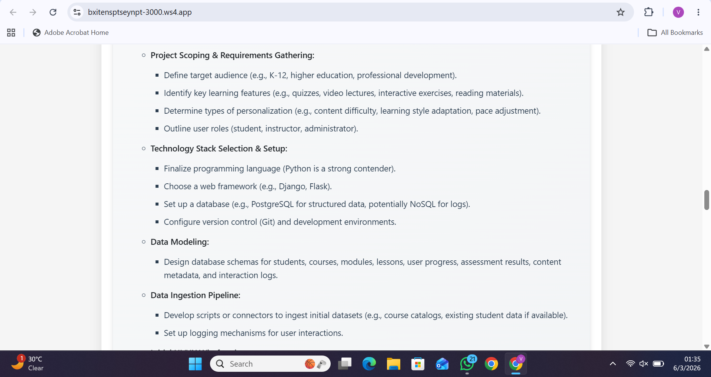
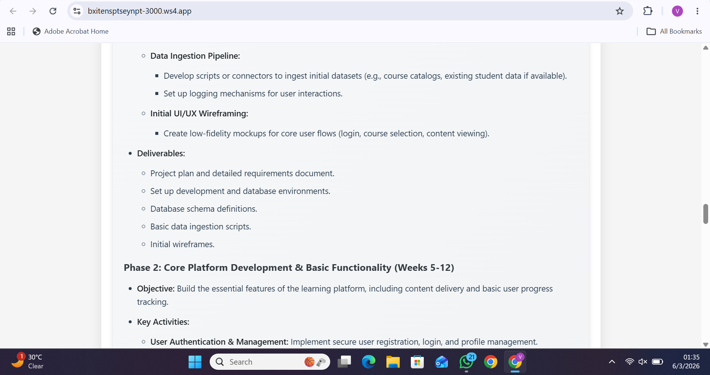
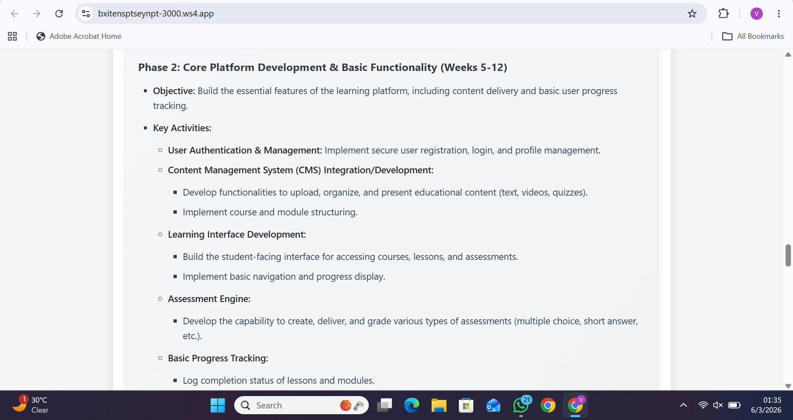
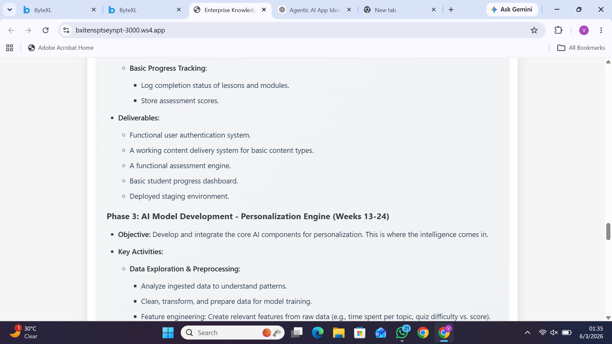
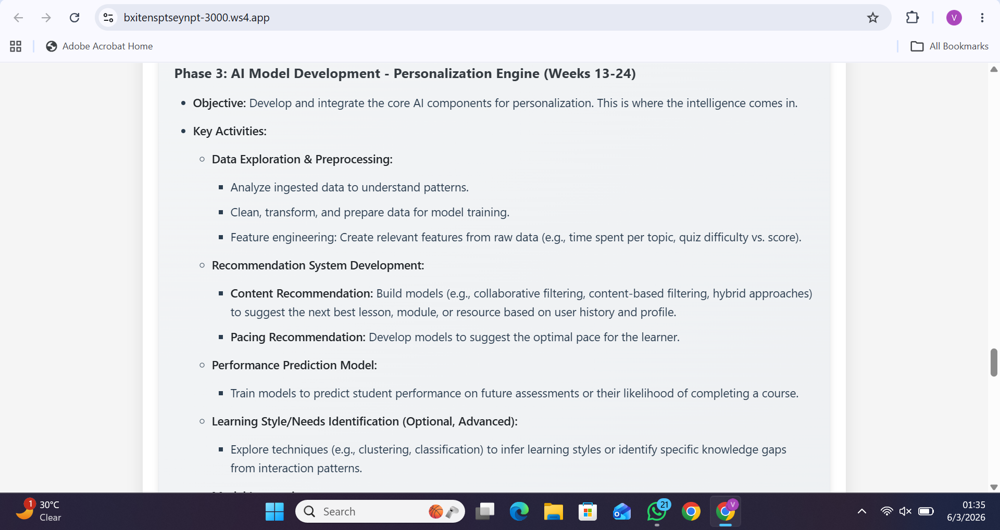
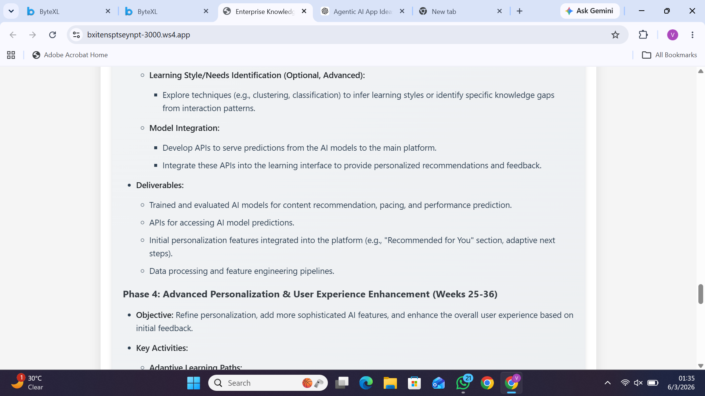
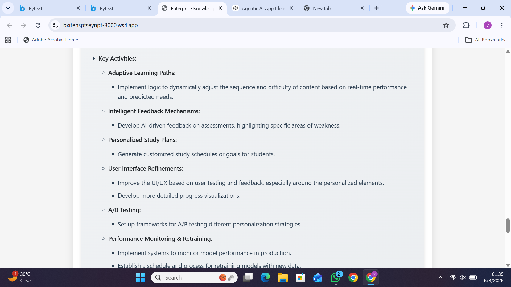
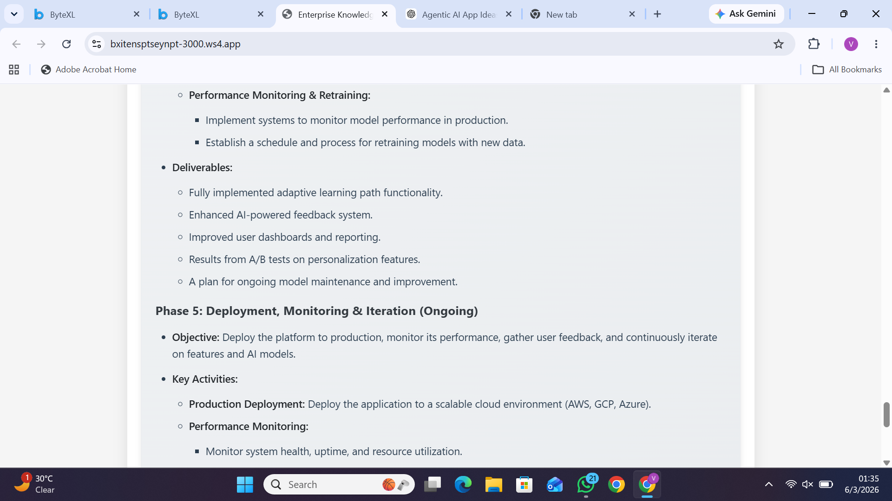
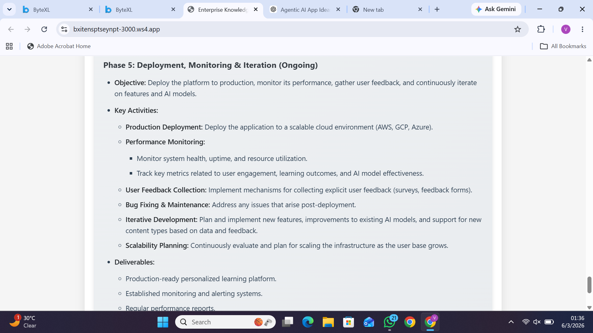
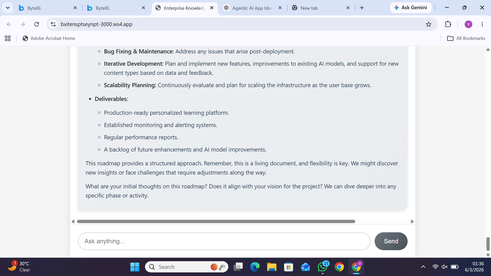

The roadmap includes:

### Phase 1

* Requirement Analysis
* Data Collection
* Database Design

### Phase 2

* Platform Development
* User Management
* Assessment Engine

### Phase 3

* AI Model Development
* Recommendation Engine
* Performance Prediction

### Phase 4

* Adaptive Learning Features
* Personalized Feedback
* User Experience Improvements

### Phase 5

* Deployment
* Monitoring
* Continuous Improvement

---

## Technology Stack Recommendations

The assistant suggests suitable technologies based on project requirements.


Recommendations may include:

* Programming Languages
* Frontend Frameworks
* Backend Frameworks
* Machine Learning Libraries
* Databases
* Cloud Platforms

---

## Dataset Recommendations

The assistant recommends relevant datasets from trusted sources.

Examples include:

* Kaggle Datasets
* UCI Machine Learning Repository
* Financial Datasets
* Healthcare Datasets
* NLP Corpora
* Research Datasets

---

## Multi-Turn Conversational Intelligence

The assistant maintains conversation context and supports follow-up questions.

### Example

```text
Give me implementation roadmap
```

The assistant understands the previously selected project and continues the discussion without requiring users to repeat information.

---

# Features

## AI Project Recommendations

Get intelligent project ideas for domains like:

* Artificial Intelligence
* Machine Learning
* NLP
* Cybersecurity
* Data Science
* CRM
* Finance
* Healthcare

---

## Technology Stack Guidance

The assistant recommends:

* Frontend Technologies
* Backend Frameworks
* Databases
* Machine Learning Libraries
* Cloud Platforms
* Deployment Strategies

---

## Dataset Recommendations

Get relevant datasets for:

* AI Projects
* Machine Learning
* NLP Applications
* Fraud Detection
* Healthcare Analytics
* Customer Analytics

---

## Learning Roadmaps

Generate structured implementation plans including:

* Beginner to Advanced Learning Path
* Development Phases
* Required Skills
* Deployment Guidance
* Best Practices

---

## Real-Time AI Chat

* Streaming AI Responses
* Context-Aware Conversations
* Multi-Turn Memory
* Fast Gemini-Powered Responses

---

# Tech Stack

| Technology          | Purpose               |
| ------------------- | --------------------- |
| Node.js             | Backend Runtime       |
| Express.js          | API Server            |
| TypeScript          | Type Safety           |
| Google Gemini API   | AI Responses          |
| AI SDK              | Streaming Integration |
| HTML/CSS/JavaScript | Frontend Interface    |

---

# Project Structure

```bash
ai-agent/
│
├── src/
│   ├── app.ts
│   └── tools.ts
│
├── public/
│   └── index.html
│
├── screenshots/
│   ├── Screenshot 1.png
│   ├── Screenshot 2.png
│   ├── Screenshot 3.png
│   ├── Screenshot 4.png
│   ├── Screenshot 5.png
│   ├── Screenshot 6.png
│   ├── Screenshot 7.png
│   ├── Screenshot 8.png
│   ├── Screenshot 9.png
│   ├── Screenshot 10.png
│   ├── Screenshot 11.png
│   ├── Screenshot 12.png
│   ├── Screenshot 13.png
│   ├── Screenshot 14.png
│   ├── Screenshot 15.png
│   ├── Screenshot 16.png
│   ├── Screenshot 17.png
│   └── Screenshot 18.png

│
├── package.json
├── tsconfig.json
├── .env
├── env.example
└── README.md
```

---

# Installation & Setup

## Clone Repository

```bash
git clone <repository-url>
cd ai-agent
```

---

## Install Dependencies

```bash
npm install
```

---

## Create Environment File

Create a `.env` file in the root directory:

```env
GOOGLE_GENERATIVE_AI_API_KEY=your_api_key_here
PORT=3000
```

---

## Get Gemini API Key

1. Visit Google AI Studio
2. Sign in with your Google account
3. Create an API Key
4. Copy the generated key
5. Add it to your `.env` file

---

## Run the Application

```bash
npm run dev
```

---

# Access the Application

Open:

```bash
http://localhost:3000
```

Or access the hosted URL provided by your workspace environment.

---

# Example Queries

Try asking:

```text
Suggest AI projects for healthcare
```

```text
Recommend datasets for fraud detection
```

```text
Give roadmap for personalized learning platform
```

```text
Suggest technology stack for NLP chatbot
```

```text
Generate CRM project ideas
```

---

# API Reference

## Chat Endpoint

```http
POST /api/chat
```

### Request Body

```json
{
  "message": "Suggest AI projects for finance"
}
```

---

# Future Improvements

* Vector Database Integration
* Retrieval-Augmented Generation (RAG)
* Authentication & Authorization
* PDF Upload Support
* Knowledge Base Integration
* Voice Assistant
* Multi-Agent Workflows
* Project Export Functionality

---

# Troubleshooting

## Port Already in Use

```bash
fuser -k 3000/tcp
```

---

## Invalid API Key

* Verify your Gemini API key
* Update the `.env` file
* Restart the application

---

## Quota Exceeded Error

Free Gemini API plans have usage limits.

Possible solutions:

* Wait for quota reset
* Use another API key
* Upgrade billing plan

---

# License

MIT License

---

# Author

Developed as an AI-powered Enterprise Knowledge & Project Intelligence Assistant using Google Gemini.
